---

---

---

## **STATS**

---

## **PINNED PROJECTS**

<table>
<tr>
<td width="50%" align="center">

### [Ark-Geo](https://github.com/UncleT-cyber/Ark-Geo)

</td>
<td width="50%" align="center">

### [MIVAPULSE](https://github.com/UncleT-cyber/mivapulse)

</td>
</tr>
<tr>
<td width="50%" align="center">

### [Smart Student Academic Portal](https://github.com/UncleT-cyber/smart-student-academic-portal)

</td>
<td width="50%" align="center">

### [Libria](https://github.com/UncleT-cyber/libria)

</td>
</tr>
</table>

---

## **TECH STACK**

<table>
<tr>
<td width="50%" valign="top">

### **Languages**

</td>
<td width="50%" valign="top">

### **Frameworks & Tools**

</td>
</tr>
</table>

---

## **CONNECT**

 

> *"THE FUTURE IS ALREADY HERE -- IT'S JUST NOT EVENLY DISTRIBUTED."* -- **William Gibson**

 

 

**Stay Safe. Stay Ethical. Keep Hacking.**

